# multiple group sample test

Use NPXplore 1.0.0 or later. Run the main examples from top to bottom. Alternative statistical models are marked explicitly; choose one model before continuing.

This guide compares three or more groups using `Group`.

```r
library(NPXplore)
# Run from the root of your cloned NPXplore repository.
```

## 1. Read NPX file

Read NPX measurements and metadata. The package supplies the default HT annotation.

```r
inputs <- NPXplore::npx_read_files(
  data_file = "example/NPXfile.parquet",
  meta_file = "example/metadata.csv"
)
```

## 2. QC experiment

Calculate QC from the original measurements and save reports under `QC`.

```r
qc <- NPXplore::npx_qc_reports(
  inputs$data, meta = inputs$meta, output_dir = "output_Group"
)
table(qc$sample_qc$QC)
```

Apply QC and cleaning. This example retains WARN samples and excludes final FAIL samples. The function also saves `metadata_used.csv` and `QCreport_metadata.csv`.

```r
prepared <- NPXplore::npx_apply_qc(
  inputs, qc = qc, include_warn = TRUE, include_fail = FALSE,
  output_dir = "output_Group"
)
```

Save a QC-colored UMAP using measurements before sample exclusion.

```r
qc_umap <- NPXplore::npx_umap(prepared$qc_data, variable = "QC")
NPXplore::npx_save_plot(qc_umap, "output_Group/QC/UMAP_QC_status.pdf")
```

Inspect the distributions of the cleaned samples. These functions save their plots automatically.

```r
NPXplore::npx_iqrplot(
  prepared$data, variable = "Group", output_dir = "output_Group/Results/Distribution"
)
NPXplore::npx_distribution_boxplot(
  prepared$data, variable = "Group", output_dir = "output_Group/Results/Distribution"
)
```

### Example outputs

Selected figures from the demo pipeline run. Click a preview or the PDF link to open the original output. Results depend on the data and analysis settings.

[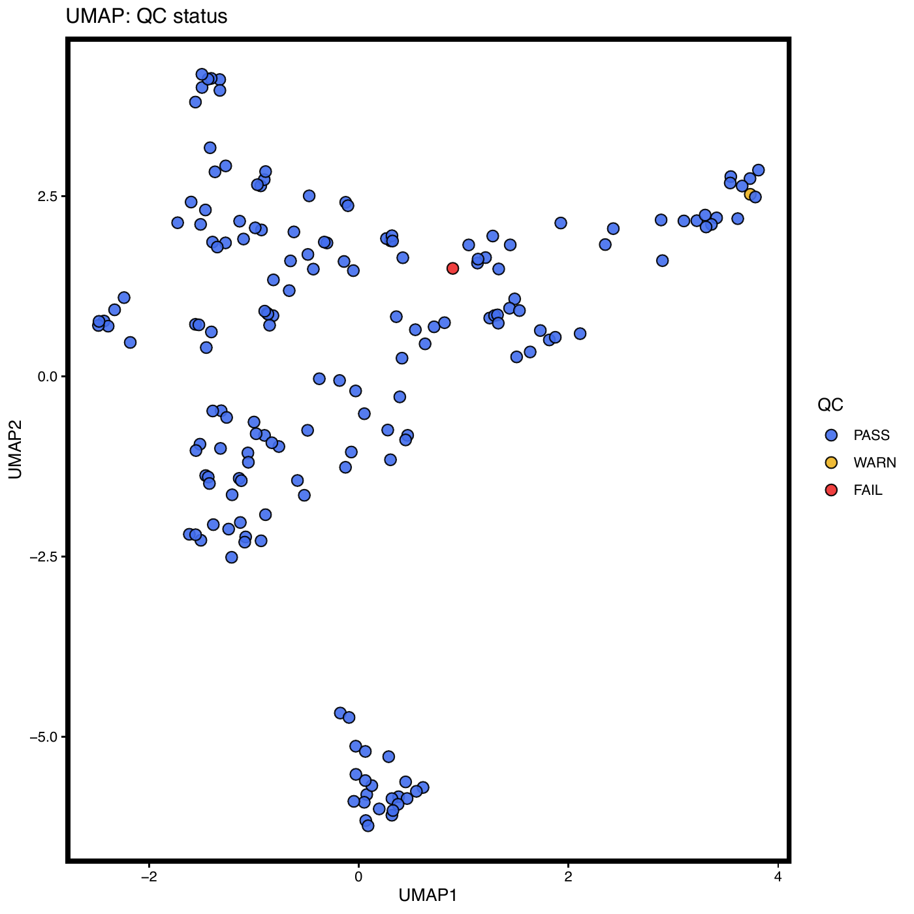](../../example/multiple_group_sample_test/QC/UMAP_QC_status.pdf)

QC status UMAP · [Open PDF](../../example/multiple_group_sample_test/QC/UMAP_QC_status.pdf)

[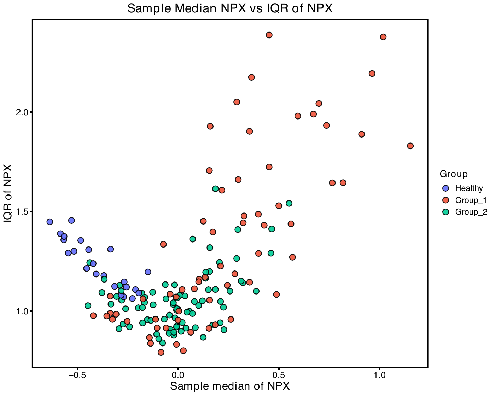](../../example/multiple_group_sample_test/Results/Distribution/IQRplot.pdf)

Sample IQR · [Open PDF](../../example/multiple_group_sample_test/Results/Distribution/IQRplot.pdf)

[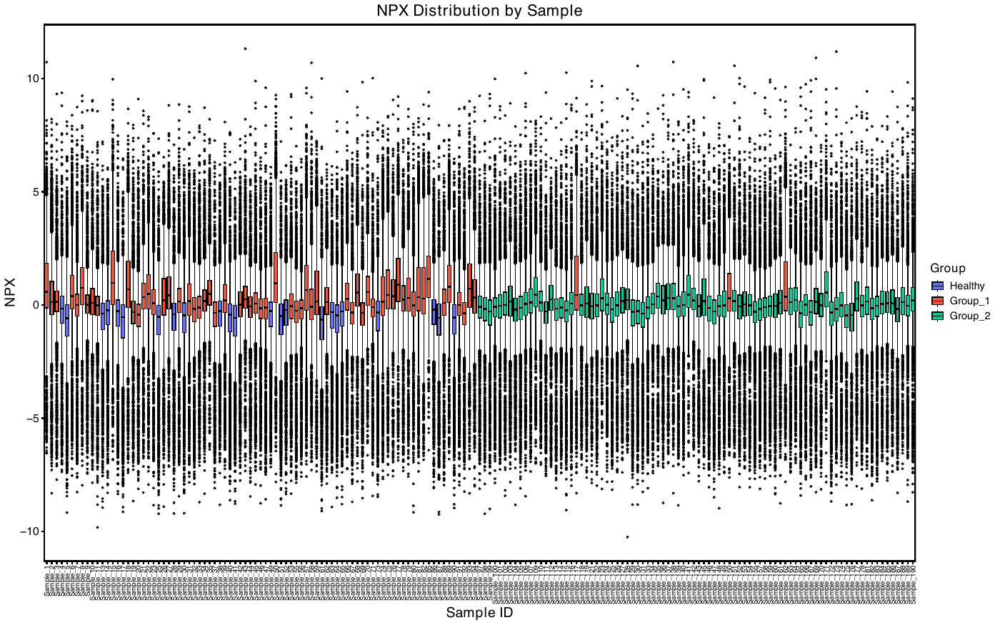](../../example/multiple_group_sample_test/Results/Distribution/boxplot.pdf)

Sample NPX distributions · [Open PDF](../../example/multiple_group_sample_test/Results/Distribution/boxplot.pdf)

## 3. Save NPX table

Save the original metadata-matched assay data and the cleaned NPX matrix under `Tables`. Only the exported matrix uses assay-median imputation; statistical analysis still uses `prepared$data`.

```r
NPXplore::npx_export_tables(
  prepared$data, raw_data = prepared$raw_data, output_dir = "output_Group"
)
```

## 4. Statistical analysis

The default DEP cutoff is adjusted p-value < 0.05. Statistical functions return all tested assays in `analysis$result` and selected DEPs in `analysis$deps`.
### ANOVA: basic model

Use this model without covariates. Run its matching post-hoc test on the selected DEPs.

```r
analysis <- NPXplore::npx_anova(prepared$data, variable = "Group")
posthoc <- NPXplore::npx_anova_posthoc(
  prepared$data, analysis = analysis, variable = "Group"
)
```

### ANOVA with covariates: alternative model

To adjust for `SEX` and `exposure`, replace the two calls above with the following block. The example metadata stores sex in `Sex`; the code below creates the factor `SEX` from it. Both model covariates must contain no missing values and permit an estimable model. Keep `exposure` numeric for a continuous covariate, or convert it to a factor if it represents categories. Use the same covariates for ANOVA and post-hoc testing.

```r
prepared$data$SEX <- factor(prepared$data$Sex)

analysis <- NPXplore::npx_anova(
  prepared$data, variable = "Group", covariates = c("SEX", "exposure")
)
posthoc <- NPXplore::npx_anova_posthoc(
  prepared$data, analysis = analysis, variable = "Group",
  covariates = c("SEX", "exposure")
)
```

The API argument is `covariates`. ANOVA has no single directional Log2FC, so this workflow does not use a volcano plot. Post-hoc results describe pairwise group contrasts.

### Save statistical results

Save the complete statistical table and DEP table, together with the matching post-hoc results. `save_npx = FALSE` preserves the NPX files already saved in step 3.

```r
NPXplore::npx_export_tables(
  prepared$data, analysis = analysis, posthoc = posthoc,
  output_dir = "output_Group", save_npx = FALSE
)
```

## 5. Clustering analysis

Cluster the DEP expression profiles using k-means. The default selects the cluster count using the silhouette index. `scale_rows = FALSE` keeps the original NPX scale; use `TRUE` when your goal is to cluster standardized relative patterns. At least four usable DEP profiles are needed, and insufficient or identical profiles can prevent clustering.

```r
clusters <- NPXplore::npx_cluster_assays(prepared$data, analysis, scale_rows = FALSE)
```

Save the DEP table with cluster assignments, followed by the cluster heatmap and line plot.

```r
NPXplore::npx_export_tables(
  prepared$data, analysis = analysis, cluster_result = clusters,
  output_dir = "output_Group", save_npx = FALSE
)
NPXplore::npx_cluster_heatmap(
  prepared$data, analysis, variable = "Group", cluster_result = clusters,
  output_dir = "output_Group/Results/DEPs/Clustering"
)
NPXplore::npx_cluster_lineplot(
  prepared$data, analysis, variable = "Group", cluster_result = clusters,
  output_dir = "output_Group/Results/DEPs/Clustering"
)
```

If clustering cannot run, omit cluster plots and cluster-specific GO. For all-DEP PPI, use `cluster_result = NULL` in step 10; cluster-dependent outputs will be reported as unavailable.

### Example outputs

Selected figures from the demo pipeline run. Click a preview or the PDF link to open the original output. Results depend on the data and analysis settings.

[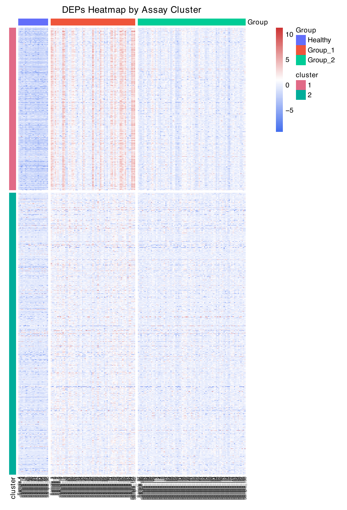](../../example/multiple_group_sample_test/Results/DEPs/Clustering/DEPs_cluster_heatmap.pdf)

DEP cluster heatmap · [Open PDF](../../example/multiple_group_sample_test/Results/DEPs/Clustering/DEPs_cluster_heatmap.pdf)

[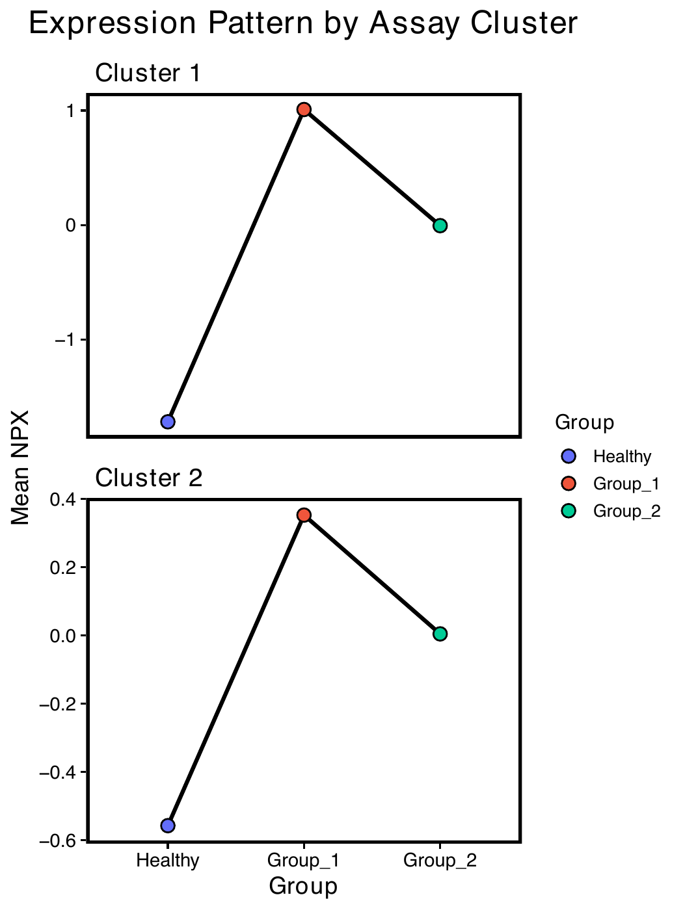](../../example/multiple_group_sample_test/Results/DEPs/Clustering/DEPs_Cluster_Lineplot.pdf)

DEP cluster profiles · [Open PDF](../../example/multiple_group_sample_test/Results/DEPs/Clustering/DEPs_Cluster_Lineplot.pdf)

## 6. UMAP

Calculate UMAP from the cleaned analysis data and save it.

```r
umap <- NPXplore::npx_umap(prepared$data, variable = "Group")
NPXplore::npx_save_plot(umap, "output_Group/Results/UMAP/UMAP.pdf")
NPXplore::npx_save_plot(umap, "output_Group/Results/UMAP/UMAP.png")
```

### Example outputs

Selected figures from the demo pipeline run. Click a preview or the PDF link to open the original output. Results depend on the data and analysis settings.

[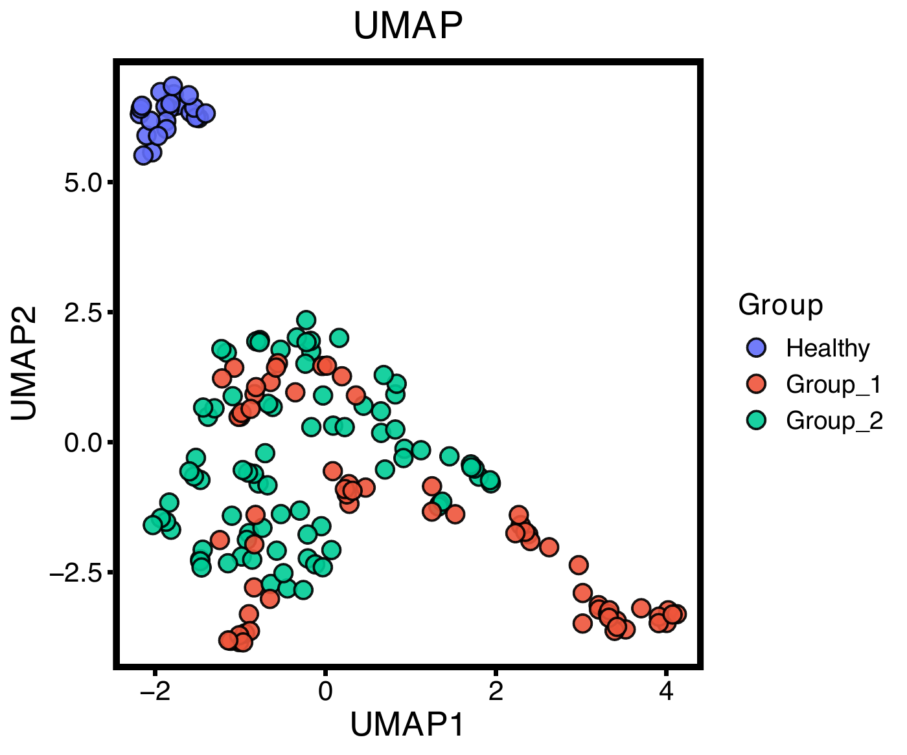](../../example/multiple_group_sample_test/Results/UMAP/UMAP.pdf)

Analysis UMAP · [Open PDF](../../example/multiple_group_sample_test/Results/UMAP/UMAP.pdf)

## 7. Heatmap

### All assays

Plot NPX values without row-wise standardization, then save the heatmap.

```r
heatmap_all <- NPXplore::npx_heatmap(prepared$data, variable = "Group", scale_rows = FALSE)
NPXplore::npx_save_plot(heatmap_all, "output_Group/Results/Heatmap/Heatmap_NPX.pdf")
```

### DEPs

Run this section only if `analysis$deps` contains assays.

```r
heatmap_deps <- NPXplore::npx_heatmap(
  prepared$data, variable = "Group", assays = analysis$deps$Assay, scale_rows = FALSE
)
NPXplore::npx_save_plot(heatmap_deps, "output_Group/Results/DEPs/DEPs_heatmap.pdf")
```

### Pathway-specific DEPs

Use the annotation's `Human_Pathway` assignments. This function creates and saves the pathway heatmaps.

```r
NPXplore::npx_pathway_heatmaps(
  prepared$data, analysis, inputs$anno, variable = "Group",
  output_dir = "output_Group/Results/DEPs/Heatmap_Pathway"
)
```

### Example outputs

Selected figures from the demo pipeline run. Click a preview or the PDF link to open the original output. Results depend on the data and analysis settings.

[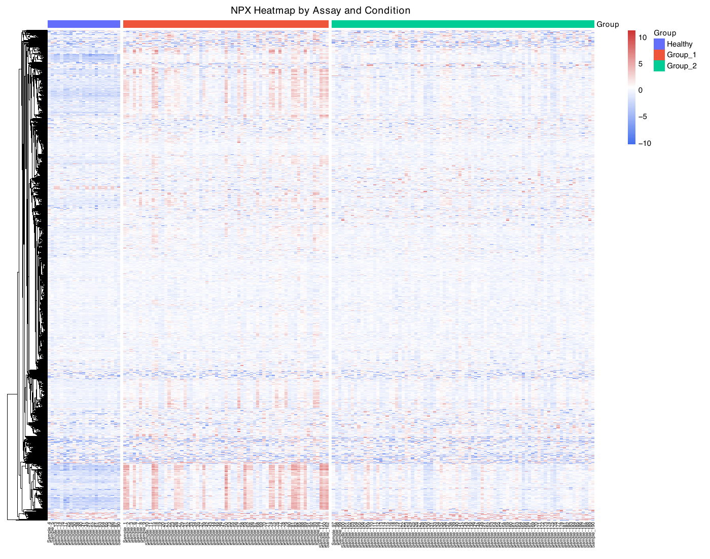](../../example/multiple_group_sample_test/Results/Heatmap/Heatmap_NPX.pdf)

All-assay heatmap · [Open PDF](../../example/multiple_group_sample_test/Results/Heatmap/Heatmap_NPX.pdf)

[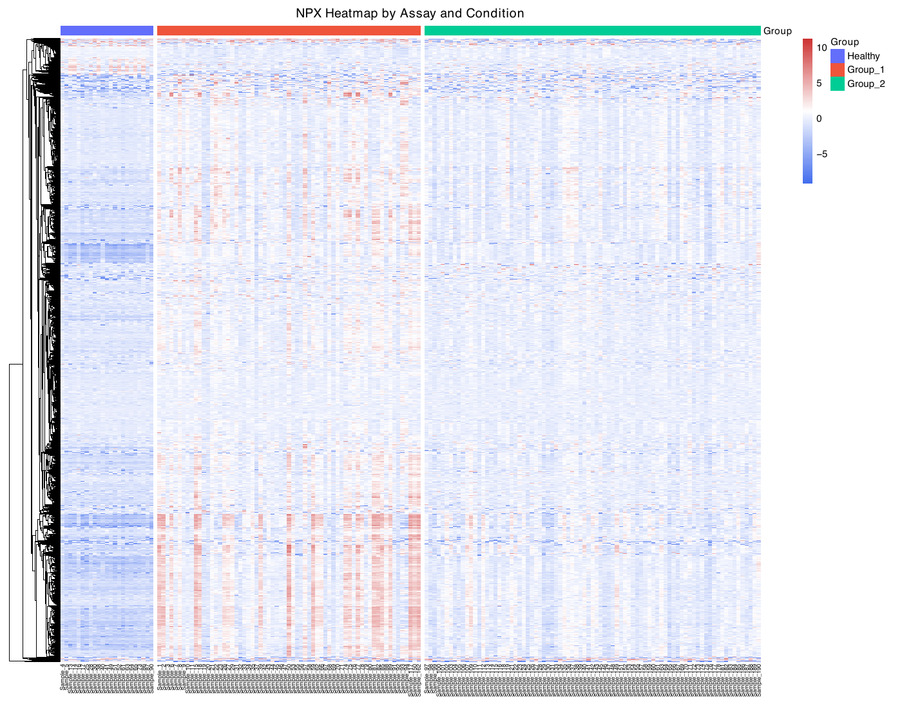](../../example/multiple_group_sample_test/Results/DEPs/DEPs_heatmap.pdf)

DEP heatmap · [Open PDF](../../example/multiple_group_sample_test/Results/DEPs/DEPs_heatmap.pdf)

[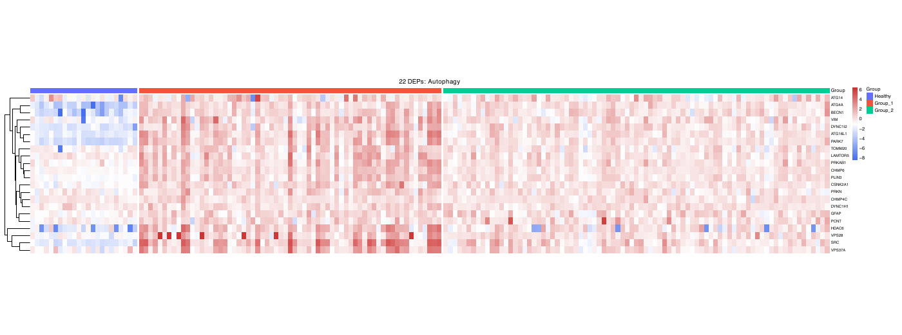](../../example/multiple_group_sample_test/Results/DEPs/Heatmap_Pathway/Heatmap_DEPs_Autophagy.pdf)

Example pathway: Autophagy · [Open PDF](../../example/multiple_group_sample_test/Results/DEPs/Heatmap_Pathway/Heatmap_DEPs_Autophagy.pdf)

## 8. Boxplot for each Assays

Save individual plots for all assays. This can take considerable time on large panels.

```r
NPXplore::npx_dep_boxplot(
  prepared$data, analysis, meta = prepared$meta, variable = "Group",
  output_dir = "output_Group/Results/DEPs/Boxplot"
)
```

To save only DEP assays instead, add `assays = analysis$deps$Assay` to the call above.

### Example outputs

Selected figures from the demo pipeline run. Click a preview or the PDF link to open the original output. Results depend on the data and analysis settings.

[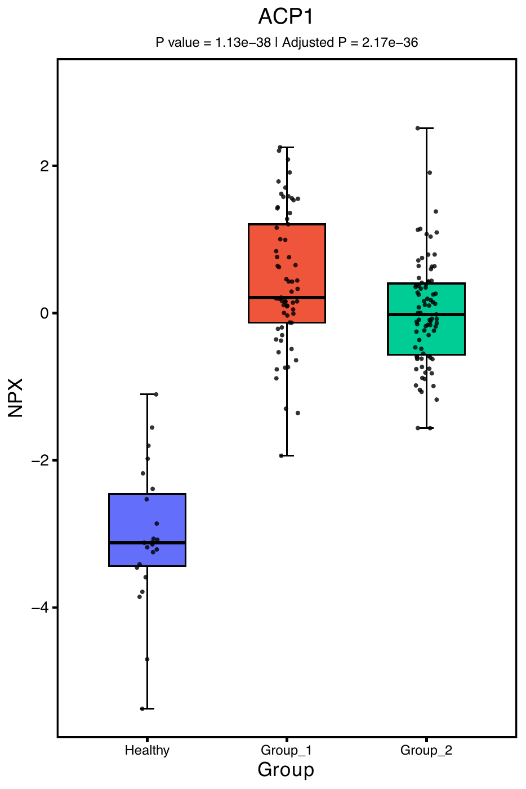](../../example/multiple_group_sample_test/Results/DEPs/Boxplot/ACP1_boxplot.pdf)

Example assay: ACP1 · [Open PDF](../../example/multiple_group_sample_test/Results/DEPs/Boxplot/ACP1_boxplot.pdf)

[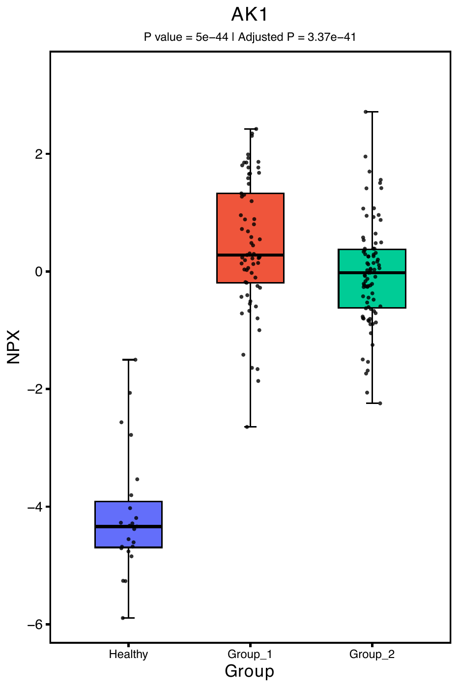](../../example/multiple_group_sample_test/Results/DEPs/Boxplot/AK1_boxplot.pdf)

Example assay: AK1 · [Open PDF](../../example/multiple_group_sample_test/Results/DEPs/Boxplot/AK1_boxplot.pdf)

## 9. Gene Ontology analysis

Analyze DEPs separately within each expression cluster. GO/KEGG queries send selected protein identifiers to Enrichr. The function saves tables and plots under `Results/GeneOntology`.

Select the top 10 terms by Combined Score among terms with adjusted p-value <= 0.05; display those terms in descending GeneRatio order.

```r
functional <- NPXplore::npx_functional_analysis(
  analysis, data = prepared$data, cluster_result = clusters,
  output_dir = "output_Group", padj_cutoff = 0.05, top_n = 10
)
functional$status
functional$diagnostics
```

The diagnostics distinguish empty inputs, no significant terms, server/query errors, and output errors.

### Example outputs

Selected figures from the demo pipeline run. Click a preview or the PDF link to open the original output. Results depend on the data and analysis settings.

[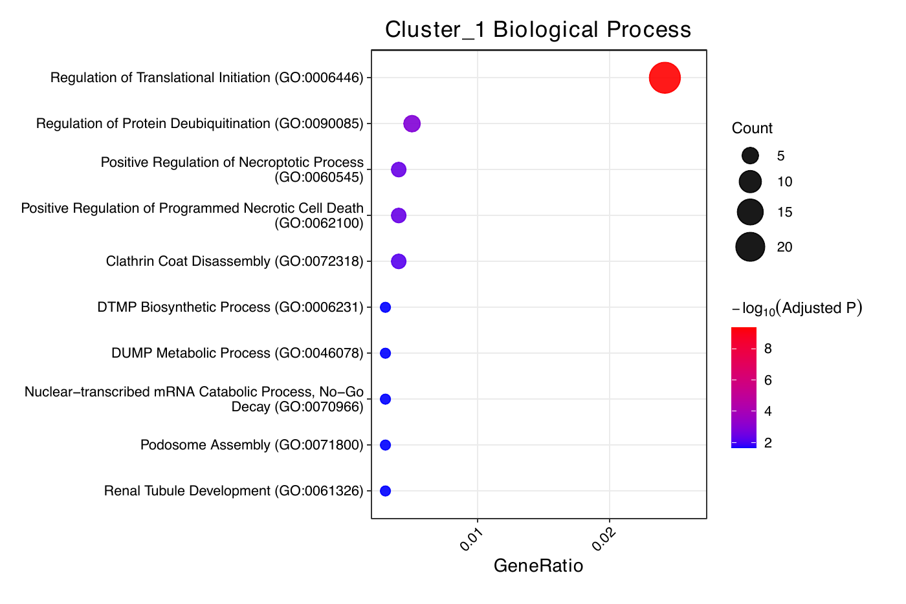](../../example/multiple_group_sample_test/Results/GeneOntology/Cluster_1/Cluster_1_GO_Biological_Process.pdf)

Cluster 1: biological process · [Open PDF](../../example/multiple_group_sample_test/Results/GeneOntology/Cluster_1/Cluster_1_GO_Biological_Process.pdf)

[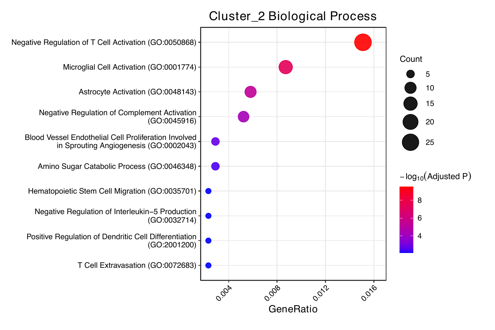](../../example/multiple_group_sample_test/Results/GeneOntology/Cluster_2/Cluster_2_GO_Biological_Process.pdf)

Cluster 2: biological process · [Open PDF](../../example/multiple_group_sample_test/Results/GeneOntology/Cluster_2/Cluster_2_GO_Biological_Process.pdf)

## 10. Protein-Protein Interaction

Create and save STRING networks for all DEPs and each expression cluster. Pathway networks use the same annotation as the pathway heatmaps.

```r
ppi <- NPXplore::npx_ppi_network(
  analysis, data = prepared$data, anno = inputs$anno, cluster_result = clusters,
  output_dir = "output_Group"
)
ppi$status
ppi$summary
```

All-DEP and cluster networks color nodes by `-log10(adjusted p-value)`. Pathway networks color nodes by cluster number.

Networks and node/edge tables are saved under `Results/STRING_PPI`; pathway outputs are under `Results/STRING_PPI/Pathways`. The summary distinguishes insufficient mapping, absent interactions, query failures, and export failures.

### Example outputs

Selected figures from the demo pipeline run. Click a preview or the PDF link to open the original output. Results depend on the data and analysis settings.

[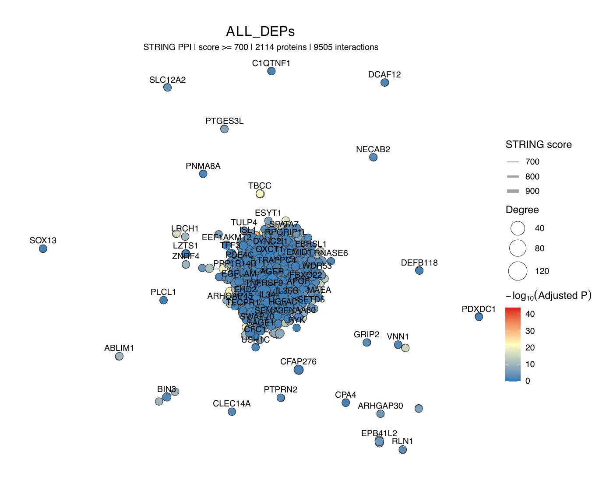](../../example/multiple_group_sample_test/Results/STRING_PPI/ALL_DEPs_STRING.pdf)

All-DEP STRING network · [Open PDF](../../example/multiple_group_sample_test/Results/STRING_PPI/ALL_DEPs_STRING.pdf)

[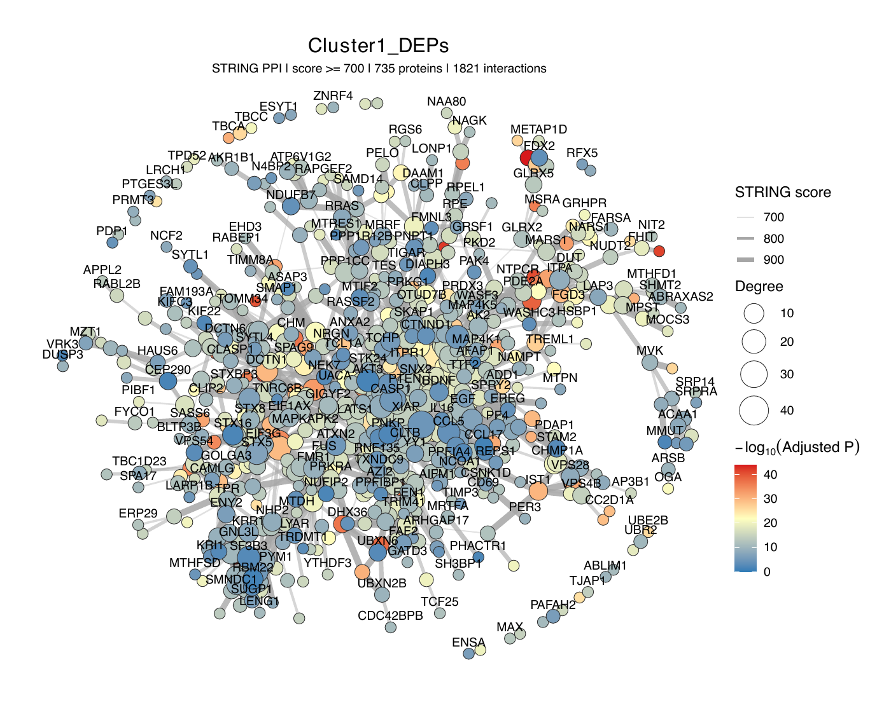](../../example/multiple_group_sample_test/Results/STRING_PPI/Cluster_1/Cluster1_DEPs_STRING.pdf)

Example cluster STRING network: Cluster 1 · [Open PDF](../../example/multiple_group_sample_test/Results/STRING_PPI/Cluster_1/Cluster1_DEPs_STRING.pdf)

